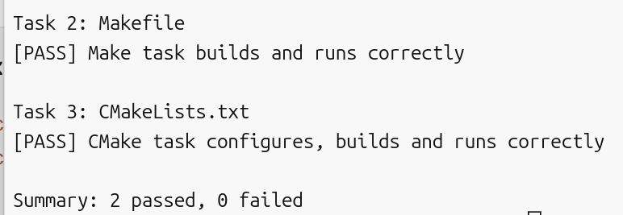

# Task 4：思考题

## 1. Make 和简单的 build.sh 有什么区别？

在这里作答。
如果磁盘里有相应的文件，前者就不会编译，后者还是会编译

## 2. CMake 是编译器吗？

执行 `cmake --build build` 时，最终是谁在编译 C 源文件？

在这里作答。
gcc在编译

## 3. 为什么不希望每次都重新编译所有 `.c` 文件？

在这里作答。
项目大的时候不编译已经编译过的可以节省很多时间

## 最终检查结果
